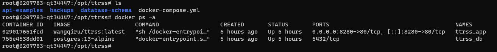
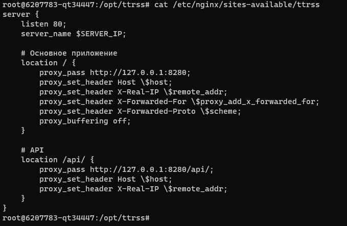
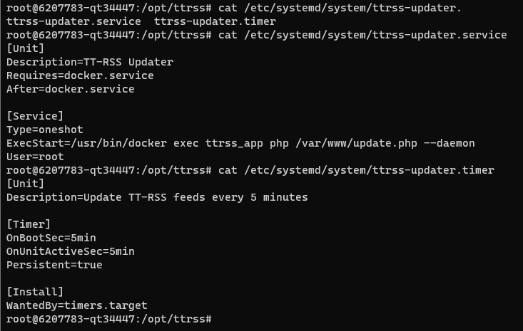

# Развёртывание и настройка TT-RSS (Tiny Tiny RSS)
Проект по развёртыванию полнофункциональной системы агрегации RSS-лент с использованием TT-RSS, Docker, PostgreSQL и Nginx.

# Цель проекта
Создать рабочую среду для централизованного сбора новостных материалов с поддержкой автоматической загрузки RSS-источников и доступа через API.

# Выполненные задачи

## ✅ 1.1. Развернуть TT-RSS в Docker

1) Создана Docker-инфраструктура с использованием docker-compose.yml
2) Использован официальный образ wangqiru/ttrss:latest
3) Наcтроены volumes для сохранения данных и иконок лент
4) Реализован автоматический перезапуск контейнеров
5) Настроить конфигурацию Nginx для входа через браузер

### Развернутые контейнеры TT-RSS на удаленном сервере Ubuntu:



### Добавленная конфигурация ttrsss для Nginx:



### Данная конфигурация в виде кода:

```
server {
    listen 80;
    server_name $SERVER_IP;

    # Основное приложение
    location / {
        proxy_pass http://127.0.0.1:8280;
        proxy_set_header Host \$host;
        proxy_set_header X-Real-IP \$remote_addr;
        proxy_set_header X-Forwarded-For \$proxy_add_x_forwarded_for;
        proxy_set_header X-Forwarded-Proto \$scheme;
        proxy_buffering off;
    }

    # API
    location /api/ {
        proxy_pass http://127.0.0.1:8280/api/;
        proxy_set_header Host \$host;
        proxy_set_header X-Real-IP \$remote_addr;
    }
}
```

Данный файл конфигурации можно найти по имени nginx-config

## ✅ 1.2. Развернуть базу данных PostgreSQL

1) Развернута PostgreSQL 13 в контейнере
2) Настроены пользователь, пароль и база данных для TT-RSS
3) Реализовано постоянное хранение данных через Docker volumes
4) Настроена сеть для связи между контейнерами

Полную схему можно посмотреть в репозитории database-schema/full_schema.sql
   
## ✅ 1.3. Настроить автоматическое обновление новостей

1) Использован встроенный в образ TT-RSS механизм обновления
2) Настроен ttrss_updater для регулярной загрузки новостей
3) Проверена работоспособность автоматического обновления лент

### Настроенные ttrss-updater:



### Код для ttrss-updater.timer:

```
[Unit]
Description=Update TT-RSS feeds every 5 minutes

[Timer]
OnBootSec=5min
OnUnitActiveSec=5min
Persistent=true

[Install]
WantedBy=timers.target
```

### Код для ttrss-updater.service:

```
[Unit]
Description=TT-RSS Updater
Requires=docker.service
After=docker.service

[Service]
Type=oneshot
ExecStart=/usr/bin/docker exec ttrss_app php /var/www/update.php --daemon
User=root
```

Данные файлы конфигруации можно найти в репозитории ttrss-update/ttrss-update.service и ttrss-update/ttrss-update.timer соотвественно

## ✅ 1.4. Добавить и настроить RSS-источники

1) Добавлены следующие рабочие RSS-источники: Habr — все публикации: https://habr.com/ru/rss/all/all/
2) Подтверждена регулярная загрузка новостей из всех источников

### Интерфейс TT-RSS в браузере:


## ✅ 1.5. Проверить API-доступ

Успешно протестированы все ключевые методы API:

1) login: Получение токена сессии
2) getFeeds: Получение списка RSS-лент
3) getHeadlines: Получение заголовков статей
4) getArticle: Получение полного текста статьи
5) search: Поиск по статьям

### Пример получения токена:

```
curl -X POST http://194.87.118.106/api/ \
  -H "Content-Type: application/json" \
  -d '{"op": "login", "user": "admin", "password": "password"}'
```

### Получение списка лент (с токеном, полученным в предыдущем примере):

```
curl -X POST http://194.87.118.106/api/ \
  -H "Content-Type: application/json" \
  -d '{"op": "getFeeds", "sid": "ваш_токен", "cat_id": -3}'
```

# На данном этапе настройка и тестирование связностей с Docker завершается


