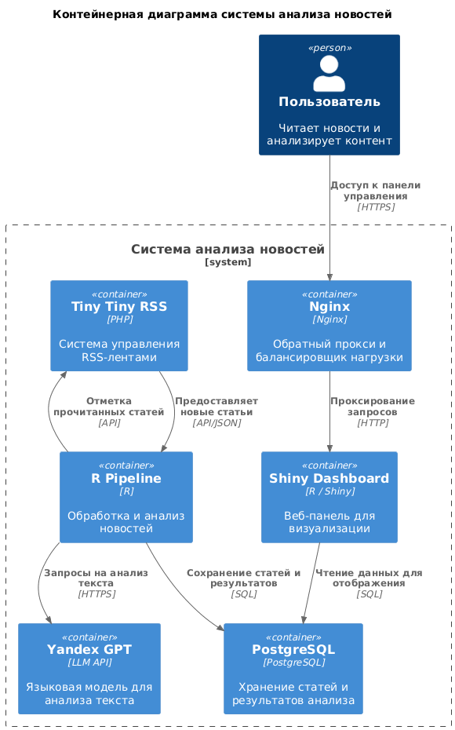

# NewsHarvestR - ETL Pipeline для обработки новостей из TT-RSS с использованием YandexGPT

NewsHarvestR — это комплексное программное решение для автоматического сбора, интеллектуального анализа и визуализации новостного контента. Проект представляет собой полноценный ETL-пайплайн, разработанный как R-пакет, который интегрирует современные технологии: от RSS-агрегатора и нейросетевых моделей до баз данных и веб-дашбордов. Его модульная архитектура позволяет гибко адаптироваться под различные нужды мониторинга информационного поля.

## Цель проекта

Главной целью проекта является полная автоматизация цикла работы с новостями — от подписки на источники до получения готовых аналитических инсайтов. В отличие от ручного просмотра лент или простых агрегаторов, NewsHarvestR самостоятельно извлекает непрочитанные новости из системы TT-RSS (Tiny Tiny RSS), проводит их глубокий семантический анализ с помощью YandexGPT, структурированно сохраняет обогащенные данные в PostgreSQL и предоставляет интерактивный дашборд для исследования результатов. Это позволяет исследователям, аналитикам и IT-специалистам эффективно вычленять и классифицировать значимые события и тренды из огромного потока информации, экономя время и снижая когнитивную нагрузку.

## Функции и модули

### 1. API-клиент для TT-RSS ([`R/ttrss_client.R`](R/ttrss_client.R:1))

Реализован модуль с использованием библиотеки `httr2`, который обеспечивает:

- Авторизацию через API и получение `session_id` для последующих запросов
- Получение непрочитанных (fresh) новостей из всех лент
- Конвертацию JSON данных в R DataFrame
- Функцию отметки новостей как прочитанных

### 2. Клиент YandexGPT ([`R/llm_client.R`](R/llm_client.R:1))

Разработан модуль для взаимодействия с Yandex Cloud Foundation Models с настроенным системным промптом для выполнения трех задач за один проход:

- Классификации текста (короткий тег, максимум 2 слова)
- Суммаризации (короткое содержание, максимум 1 предложение)
- Оценки важности для IT (число 1-10)

### 3. Модуль хранения данных ([`R/db_storage.R`](R/db_storage.R:1))

Разработан модуль для:

- Подключения к PostgreSQL базе данных
- Создания таблицы `news_analysis` при необходимости
- Сохранения результатов анализа новостей в базу данных с защитой от дублирования
- Обеспечения безопасности через параметризованные запросы

### 4. Модуль очистки текста ([`R/text_cleaner.R`](R/text_cleaner.R:1))

Разработан модуль для:

- Удаления HTML тегов, скриптов и стилей из текста новостей
- Очистки текста от лишних пробелов
- Подготовки текста для корректной обработки LLM и обеспечения качества входных данных

### 5. Основной пайплайн ([`R/pipeline.R`](R/pipeline.R:1))

Создан управляющий скрипт, который:

- Объединяет все компоненты системы
- Настроена работа с переменными окружения (.env) для безопасности ключей API
- Реализована интеграция всех компонентов
- Внедрена обработка ошибок и логирование процесса
- Обеспечивает обработку указанного количества новостей за один запуск

### 6. Аналитический дашборд ([`R/run_dashboard.R`](R/run_dashboard.R:1) и [`inst/dashboard/app.R`](inst/dashboard/app.R:1))

Разработан интерактивный дашборд с визуализацией обработанных новостей из базы данных, включающий:

- КПЭ (общее количество новостей, средняя оценка, топ категории)
- Временную динамику публикаций
- Распределение оценок релевантности
- Таблицу последних новостей с возможностью фильтрации по дате, категории и оценке
- Часовое распределение новостей
- Тепловую карту по дням и категориям

### 7. MCP сервер ([`mcp/server.py.txt`](mcp/server.py.txt:1))

Реализован сервер MCP (Model Context Protocol) для взаимодействия с TT-RSS, обеспечивающий:

- Инструменты для получения активных функций
- Инструменты для авторизации в TT-RSS
- Инструменты для поиска заголовков новостей
- Безопасность транспорта и проверку хостов

## Детальное описание пайплайна

### Общая архитектура

Пайплайн построен по принципам модульности и отказоустойчивости. Он автоматически, без участия человека, выполняет полный цикл: получение "сырых" новостей из TT-RSS → их очистка → интеллектуальный анализ с помощью YandexGPT → сохранение структурированных результатов в PostgreSQL → отметка о прочтении. Процесс может запускаться по расписанию (например, через cron или системный таймер) и обрабатывает заданное количество новостей за итерацию, что делает систему управляемой и ресурсоэффективной. Все действия подробно логируются, обеспечивая полную наблюдаемость (observability) за работой системы.

### Процесс обработки

1. **Инициализация**:
   - Загрузка конфигурации из защищенного файла .env файла
   - Установка соединения с API TT-RSS и аутентификация (получение session_id)
   - Подключение к целевой базе данных PostgreSQL и гарантия существования таблицы news_analysis

2. **Получение новостей**:
   - Запрос непрочитанных новостей из TT-RSS (ограничение по количеству)
   - Проверка наличия новых новостей

3. **Обработка каждой новости**:
   - Очистка текста от HTML-разметки с помощью модуля `text_cleaner.R`
   - Классификация, суммаризация и оценка важности с помощью YandexGPT
   - Сохранение результатов в базу данных `news_analysis` с проверкой на дубликаты
   - Отметка новости как прочитанной в TT-RSS

4. **Обработка ошибок и лоигрование**:
   - На каждом шаге реализованы tryCatch-блоки. Ошибка (например, недоступность API YandexGPT) не ломает весь цикл — информация об ошибке записывается в лог, а пайплайн переходит к следующей новости.
   - Логирование ошибок для последующего анализа
   - Между обработкой отдельных новостей добавлена короткая пауза (Sys.sleep()) для соблюдения лимитов запросов к внешним AP

5. **Корректное завершение**:
   - По окончании цикла все соединения с базами данных аккуратно закрываются
   - В лог выводится итоговый отчет: количество успешно обработанных и пропущенных из-за ошибок новостей

### Используемые переменные окружения

- `TTRSS_URL`, `TTRSS_USER`, `TTRSS_PASS` - параметры для подключения к TT-RSS
- `YA_FOLDER_ID`, `YA_API_KEY` - параметры для доступа к YandexGPT
- `DB_HOST`, `DB_PORT`, `DB_NAME`, `DB_USER`, `DB_PASS` - параметры для подключения к PostgreSQL
- `PIPELINE_ITEMS_COUNT` - количество новостей для обработки за один запуск (по умолчанию 5)
- `PIPELINE_INTERVAL` - интервал между запусками пайплайна в секундах (по умолчанию 300)

## Архитектура

### Общая схема

Система построена по модульной архитектуре с использованием Docker-контейнеров. Основные компоненты включают:

- **TT-RSS сервер**: Специализированный агрегатор, отвечающий за подписку на RSS-ленты и предоставление новостей через API.
- **PostgreSQL база данных**: Изолированная база данных, предназначенная исключительно для хранения обогащенных данных, полученных в результате работы пайплайна (таблица news_analysis).
- **Пайплайн на R**: Ядро системы, развернутое в среде R. Выполняет роль оркестратора и процессора данных.
- **Дашборд на Shiny**: Легковесное веб-приложение, подключенное к аналитической БД для визуализации.
- **MCP сервер**: Опциональный компонент, предоставляющий API TT-RSS как инструмент для LLM через стандартный протокол.

### Важное замечание об архитектуре

**База данных с проанализированными новостями изолирована и находится на отдельном инстансе.** Это обеспечивает:

- Повышенную безопасность данных
- Независимость от основной инфраструктуры TT-RSS
- Возможность масштабирования и резервного копирования
- Разделение зон ответственности между системами

### Схема взаимодействия компонентов


### Структура базы данных

#### Таблица `news_analysis`

| Поле | Тип | Описание |
|------|-----|----------|
| `id` | SERIAL | Уникальный идентификатор записи (первичный ключ) |
| `news_id` | TEXT | Уникальный идентификатор новости из TT-RSS |
| `title` | TEXT | Заголовок новости |
| `link` | TEXT | Ссылка на новость |
| `published_at` | TIMESTAMP | Дата публикации новости |
| `category` | TEXT | Категория новости, определенная с помощью ИИ |
| `summary` | TEXT | Краткое содержание новости, сгенерированное с помощью ИИ |
| `score` | INTEGER | Оценка релевантности новости, определенная с помощью ИИ |
| `created_at` | TIMESTAMP | Дата и время создания записи в базе данных (автоматически заполняется текущим временем) |

#### Диаграмма структуры таблицы

```
+-------------------+-------------------+------------------+
|      Поле         |       Тип         |    Описание      |
+-------------------+-------------------+------------------+
| id                | SERIAL            | Первичный ключ   |
| news_id           | TEXT (UNIQUE)     | ID новости TT-RSS|
| title             | TEXT              | Заголовок        |
| link              | TEXT              | Ссылка на новость|
| published_at      | TIMESTAMP         | Дата публикации  |
| category          | TEXT              | Категория (ИИ)   |
| summary           | TEXT              | Суммаризация (ИИ)|
| score             | INTEGER           | Оценка (ИИ)      |
| created_at        | TIMESTAMP         | Дата создания    |
+-------------------+-------------------+------------------+
```

### Безопасность и надежность

В проект заложены принципы Secure by Design и Production-Ready Development:

- Никаких хардкодированных секретов: Все пароли, ключи API и чувствительные URL хранятся в переменных окружения, загружаемых из .env файла, который исключен из Git (.gitignore).
- Защита от инъекций: Все SQL-запросы используют параметризованные выражения (DBI::dbSendQuery), что нейтрализует риски SQL-инъекций.
- Устойчивость к сбоям: Многоуровневая обработка ошибок (tryCatch) гарантирует, что временная недоступность одного сервиса (YandexGPT, сеть) не приведет к потере данных или аварийной остановке всего пайплайна.
- Архитектурная изоляция: Разделение БД и сервисов через Docker-контейнеры создает естественные барьеры безопасности и повышает отказоустойчивость системы в целом.
  
## Тестирование

Проект включает полноценный набор модульных и интеграционных тестов, что свидетельствует о высоком уровне зрелости кодовой базы.

### Структура тестов

Проект включает комплексные тесты для всех основных модулей, реализованные с использованием фреймворка `testthat`:

- **Тесты для модуля хранения данных** (`tests/testthat/test-db-storage.R`): Проект включает полноценный набор модульных и интеграционных тестов, что свидетельствует о высоком уровне зрелости кодовой базы.
- **Тесты для клиента YandexGPT** (`tests/testthat/test-llm-client.R`): Тестирует логику клиента YandexGPT на различных сценариях: обработка коротких текстов, реакция на имитацию сетевых ошибок и таймаутов, парсинг ответов модели.
- **Тесты для модуля очистки текста** (`tests/testthat/test-text-cleaner.R`): Убеждается, что модуль корректно удаляет сложные HTML-конструкции, скрипты, стили и нормализует пробельные символы в тексте.
- **Тесты для клиента TT-RSS** (`tests/testthat/test-ttrss-client.R`)Проверяет базовые функции клиента TT-RSS: успешность авторизации и получения session_id, корректность парсинга ответа со списком новостей, работу функции отметки как прочитанной.
- **Тесты для основного пайплайна** (`tests/testthat/test-pipeline.R`): Интеграционные тесты, которые проверяют взаимодействие всех модулей в миниатюре, включая обработку ошибок и логирование.

### Запуск тестов

Для поддержания качества кода и регрессионного тестирования используется стандартный рабочий процесс R:

```R
# Установка зависимостей
install.packages("testthat")

# Запуск всех тестов
devtools::test()
```

### Покрытие кода

Для количественной оценки качества тестов используется инструмент covr. Запуск скрипта generate_coverage_report.R генерирует детальный отчет в формате HTML, который наглядно показывает, какие строки кода в каждом модуле были задействованы при выполнении тестов, а также сводный отчет в JSON, пригодный для интеграции в CI/CD-пайплайны. Это позволяет целенаправленно улучшать тестовое покрытие.

